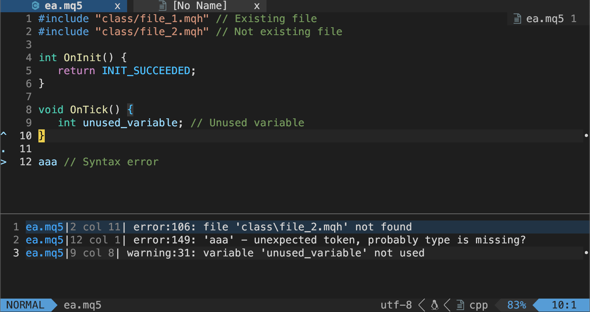
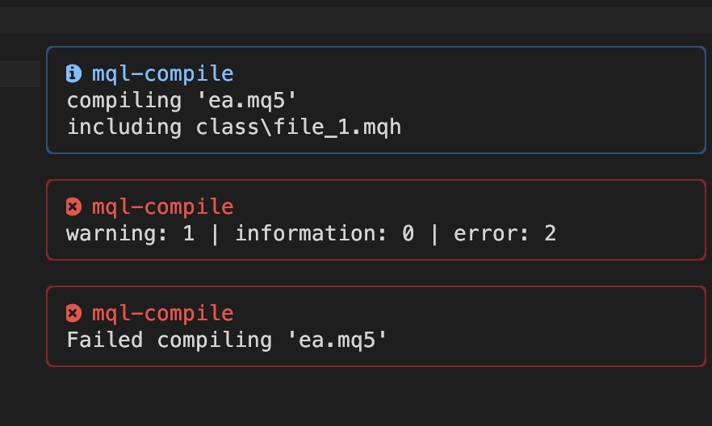
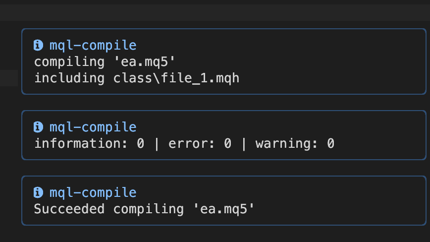

# mql-compile.nvim


## Concept

A neovim plugin for compiling MQL5/MQL4 scripts asyncronously.  
Without heavy MetaEditor GUI. (Compiling on command-line).

> [!Caution]
> It's a test version.  

Be careful to use at your own risk. Backup your files before testing.

> [!Warning]
> Not tested in Windows or Linux  

Currently ensured to work only in 'macOS + wine(wineskin)' environment.  
If anyone encounters any problems while using/testing, please [create an issue](https://github.com/riodelphino/mql-compile.nvim/issues/new) on GitHub.
Any reports are welcome, like mql-compile.nvim worked in your environment.


## Screenshots

With [nvim-notify](https://github.com/rcarriga/nvim-notify)

> [!Note]
> Sorry, these pics are from older ver.

Quickfix (error)


Notify (error)


Notify (success)



## Features

**Main features**
- Async compiling MQL5/MQL4
- Show quickfix
- Auto detect MQL5/MQL4
- Works on `MacOS + wine(wineskin)` for now

**Not implemented**
- Works on `Windows` (Need tested)
- Works on `Linux` (Need tested)


## Requirement

**Mandatory**
- nvim v0.10.2 (My environment. It seems to work in a little older versions.)
- MT5 or MT4 installed (through wine/wineskin, for now)
- [plenary.nvim](https://github.com/nvim-lua/plenary.nvim) for async

**Optional plugins**
- [mql-filetype.nvim](https://github.com/riodelphino/mql-compile.nvim) Change filetypes from MQL4/MQL5 to c/cpp automatically
- [nvim-notify](https://github.com/rcarriga/nvim-notify) Cool style notify messages
- [nvim-bqf](https://github.com/kevinhwang91/nvim-bqf) Super easy to use quickfix
- [nvim-pqf](https://github.com/yorickpeterse/nvim-pqf) Beautify quickfix


## Installation

Using [Lazy.nvim](https://github.com/folke/lazy.nvim):

```lua
-- Minimum config:
return {
   'riodelphino/mql-compile.nvim',
   dependencies = {
      'nvim-lua/plenary.nvim',
      'rcarriga/nvim-notify',
   },
   lazy = true,
   ft = { 'cpp', 'c' }, -- If your filetype settings read mql5 as cpp / mql4 as c.
   opts = {
      ft = {
         mql5 = {
            metaeditor_path = '~/Applications/Wineskin/MT5.app/drive_c/Program Files/MetaTrader 5/MetaEditor64.exe', -- your MT5 exe's path
         },
         mql4 = {
            metaeditor_path = '~/Applications/Wineskin/MT4.app/drive_c/Program Files (x86)/MetaTrader 4/metaeditor.exe', -- your MT4 exe's path
         },
      },
   },
   keys = {},
   cmds = {
      { 'MQLCompile', 'MQLCompileSetSource', 'MQLCompileShowOptions' },
   },
}
```

## Default options

```lua
opts = {
   debug = { -- For debug
      compile = {
         show_cmd = false,
         show_cwd = false,
      },
   },
   priority = { 'mql5', 'mql4' }, -- priority for auto file detection
   log = {
      extension = 'log',
      delete_after_load = true,
   },
   quickfix = {
      types = { 'error', 'warning' }, -- Types to pick up. 'error' | 'warning' | 'information'
      show = {
         copen = true, -- Open quickfix automatically
         with = { 'error', 'warning' }, -- Types to copen. 'error' | 'warning' | 'information'
      },
      parse = nil, -- See '# Parsing quickfix' section
   },
   information = {
      actions = { 'including' }, -- Actions to pick up. 'compiling' | 'including'
      show = {
         notify = true, -- Show 'information' independently in notify
         with = { 'including' }, -- Actions to show. 'compiling' | 'including'
      },
      parse = nil, -- See '# Parsing and formatting information' section
      format = nil, -- See '# Parsing and formatting information' section
   },
   wine = {
      enabled = true, -- On MacOS/Linux, set true for MT5/MT5 on wine(wineskin). On windows, set false.
      command = 'wine', -- Wine command path
   },
   ft = {
      mql5 = {
         metaeditor_path = '', -- '~/Applications/Wineskin/MT5.app/drive_c/Program Files/MetaTrader 5/MetaEditor64.exe', -- your MT5 exe's path
         include_path = '', -- Not supported now
         pattern = '*.mq5',
      },
      mql4 = {
         metaeditor_path = '', -- '~/Applications/Wineskin/MT4.app/drive_c/Program Files (x86)/MetaTrader 4/metaeditor.exe', -- your MT4 exe's path
         include_path = '', -- Not supported now
         pattern = '*.mq4',
      },
   },
   notify = { -- Enable/disable notify
      compile = {
         on_started = true,
         on_finished = true,
      },
      log = {
         on_saved = false,
         on_deleted = false,
      },
      quickfix = {
         on_finished = true, -- Add quickfix counts to main message on 'notify.compile.on_finished'
      },
      information = {},
      levels = { -- Color to notify if compiling was ...
         succeeded = { -- with type ...
            none = vim.log.levels.INFO,
            info = vim.log.levels.INFO,
            warn = vim.log.levels.WARN, -- *.INFO is also good, if you don't like warn color on success.
         },
         failed = vim.log.levels.ERROR,
         information = vim.log.levels.INFO, -- for notifing informations
      },
   },
   highlights = { -- Highlights & syntax on quickfix window
      enabled = true,
      hlgroups = nil, -- See '# Highlights' section
   },
},
```


## Default 'metaeditor_path'

Below are the default path for MetaEditor exe in `opts.ft.mql5` and `opts.ft.mql4`.  
(It depends on your settings on installing.)


### MT5

```lua
 -- MacOS (via wine)
 metaeditor_path = '~/Applications/Wineskin/MT5.app/drive_c/Program Files/MetaTrader 5/MetaEditor64.exe'
 -- Windows (NOT TESTED. just a note)
 metaeditor_path = 'C:\\Program Files\\MetaTrader 5\\MetaEditor64.exe'
 ```
 'MT5.app' is the name of app you set on wineskin.

### MT4

 ```lua
 -- MacOS (via wine)
 metaeditor_path = '~/Applications/Wineskin/MT5.app/drive_c/Program Files (x86)/MetaTrader 4/metaeditor.exe'
 -- Windows (NOT TESTED. just a note)
 metaeditor_path = 'C:\\Program Files (x86)\\MetaTrader 4\\metaeditor.exe'
```
 'MT4.app' is the name of app you set on wineskin.


## Parsing and formatting

You can modify parsing & formatting functions, if you need.  
Leave 'parse' or 'format' as nil to use these default functions. 


### Parsing quickfix

This is the parsing function, from log to quickfix
Default:
```lua
opts = {
   quickfix = {
      parse = function(line, type)
         local e = {}
         if type == 'error' or type == 'warning' then
            e.filename, e.lnum, e.col, e.type, e.nr, e.text = line:match('^(.*)%((%d+),(%d+)%) : (.*) (%d+): (.*)$')
         elseif type == 'information' then
            e.filename, e.type, e.text = line:match('^(.*) : (.*): (.*)$')
            e.lnum = 1
            e.col = 1
            e.nr = 0
         end
         e.type = e.type:sub(1, 1):upper() -- Convert type to E/W/I/H/N
         return e
      end,
   },
},
```

### Parsing and formatting information

This is the parsing and formatting function, from log to information

Default:
```lua
opts = {
   information = {
      parse = function(line)
         local i = {}
         i.file, i.type, i.action, i.details = line:match('^(.-) : (%w+): (%w+) (.+)')
         return i
      end,
      format = function(i)
         local formated = string.format('%s %s', i.action, i.details)
         return formated
      end,
   },
},

```

## Commands


### Compiling

This plugin compiles mql5/4 asyncronously.

```vim
" Set mql5 path
:MQLCompileSetSource my_ea.mq5
" Compile it
:MQLCompile
```
or
```vim
" Set current file path
:MQLCompileSetSource
" Compile it
:MQLCompile
```
or
```vim
" Compile with path
:MQLCompile my_ea.mq5
" Compile with file name modifier
:MQLCompile %
```

This plugin auto-detects mql5/mql4 by patterns given in `opts.ft.mql5.pattern` and `opts.ft.mql4.pattern`.
See [Auto detection rules](#auto-detection-rules).

```vim
" Set source in NO mql5/4 buffers (like *.md)
:MQLCompileSetSource
" Automatically detect file, and set it as source

" Compiling also works same way.
:MQLCompile
" Automatically detect file, and compile it
```

So, `:MQLCompileSetSource` & Auto-detection allow you to compile the file anywhere in the project.


### Show options

Show all current options as table. Just for checking.
```vim
:MQLCompileShowOptions
```

## Lua functions

Below lua functions are also available. (with auto-detection by the extension)
```lua
-- Set mql5 path
require('mql_compile').set_source('my_ea.mq5')
-- Compile it
require('mql_compile').compile()
```
or
```lua
-- Set current file path
require('mql_compile').set_source()
-- Compile it
require('mql_compile').compile()
```
or
```lua
-- Compile with path
require('mql_compile').compile('my_ea.mq5')
-- Compile with file name modifier
require('mql_compile').compile('%')
```

## Keymaps

Sample:
```lua
keys = {
    { '<F4>', '<cmd>MQLCompileSetSource<cr>' },
    { '<F7>', '<cmd>MQLCompile<cr>' },
},
```
or
```lua
keys = {
    { '<F4>', function() require('mql_compile').set_source() end },
    { '<F7>', function() require('mql_compile').compile() end },
},
```

## Highlights

> [!Warning]
> Highlighting(and syntaxing) has not finished yet.

> [!Tip]
> Quickfix highlighting should not be modified by this plugin ?

Set-up highlight groups in quickfix list.  

To use default, leave `hlgroups = nil`.
```lua
opts = {
   highlights = { -- Highlights on quickfix window
      enabled = true,
      hlgroups = {
         filename = { 'qfFileName', { link = 'Directory' } },  -- { '<Highlight name>' , { <highlight options> } }
         separator_left = { 'qfSeparatorLeft', { fg = '#cccccc' } },
         separator_right = { 'qfSeparatorRight', { fg = '#cccccc' } },
         line_nr = { 'qfLineNr', { fg = '#888888' } },
         col = { 'qfCol', { link = 'DiagnosticError' } },
         error = { 'qfError', { link = 'DiagnosticError' } },
         warning = { 'qfWarning', { link = 'DiagnosticWarn' } },
         info = { 'qfInfo', { link = 'DiagnosticInfo' } },
         hint = { 'qfHint', { link = 'DiagnosticHint' } },
         note = { 'qfNote', { link = 'DiagnosticHint' } },
         code = { 'qfCode', { fg = '#888888' } },
         text = { 'qfText', { link = 'Normal' } },
      },
   },
},
```

## Auto detection rules


### :MQLCompileSetSource

If the arg is set like `:MQLCompileSetSource %` or `:MQLCompileSetSource my_ea.mq5`, the command set it as source path preferentially.

But if no args are set, like `:MQLCompileSetSource`, the commannd detect the files automatically.  
The detection order is below.

1. Current buffer (if mql5/4)
2. First detected mql5/4 file in git root dir (recursively)
3. First detected mql5/4 file in cwd dir (recursively)

If no files are detected, the command returns `error`.

### :MQLCompile

The compiling command without arg, like `:MQLCompile`, also detects the files in almost same way.

1. Current buffer (if mql5/4)
2. The path set by `:MQLCompileSetSource` command previousely
3. First detected mql5/4 file in git root dir (recursively)
4. First detected mql5/4 file in cwd dir (recursively)

### Lua functions

And [these lua functions](#lua-functions) follow same rules.


## notify

This plugin optionally uses `vim.notify()` to show messages to users.  
For those who want to have nicer messages, follow this.

1. Install [nvim-notify](https://github.com/rcarriga/nvim-notify)
2. Put below code to replace default notify.

```lua
-- ex.) with lazy.nvim
return {
   'rcarriga/nvim-notify',
   config = function()
      vim.notify = require('notify')
   end,
}
```
Then `mql-compile` shows messages through it.


## Test codes to compile

There are some test codes in: `test/*.mq5`
- nothing.mq5
- informations.mq5
- warnings.mq5
- errors.mq5

Try to compile them for test.


## Inaccurate error displaying

> [!Warning]
> The metaeditor returns errors that do not make sense, so often.

For example,

If you forget to add ';' at the end of class:
```cpp
class ClassA {
} // line A: forgot to add ';'

class ClassB { // line B: `class 'name' expected` error occurs
};
```

The error is actually occurring on line A.  
But the MetaEditor says that line B has a different error (completely different).  
This confuses and annoys us.  
Especially, if you split files & use `#include`, it becomes quite difficult to find the cause.

Unfortunately, these are the weak point of metaeditor's linting, I guess.


## Additional notes

Researched and verified detailed data of wine and `metaeditor.exe` / `MetaEditor64.exe` commands.  
See [notes/wine_and_metaeditor.md](notes/wine_and_metaeditor.md).

Path specifications and path conversions are investigated.


## License

[MIT License](./LICENSE)


## TO-DO

- [ ] Add version management
   - [ ] grep `#property version "x.x"`
   - [ ] Auto mv ex5/ex4 to `archive` dir, after compiling
   - [x] Add `ft.mql[5/4].compiled_extension`
- [ ] `opts.information.actions` has other actions ?
   - [ ] Now only `compiling` & `including` are confirmed
- [ ] Auto compiling on save ? (Complicated...)
   - [ ] Should set source_path before.
   - [ ] Should search & dig including paths
   - [ ] If current buffer is matched to the included path ?
   - [ ] Compile source_path
- [ ] git
   - [x] Detect git root
   - [ ] Prompt for listing up files by `vim.ui.select`.
   - [ ] If only one mql5 on git root, compile without prompt
- [ ] Show fugitive message on progress & success or error
- [ ] include path NOT WORKS for the space char in `Program Files`


> [!Tip]
> Use `vim.o.errorformat` ?
> - Easy to use, but not so customizable.
> - See [naoina/syntastic-MQL](https://github.com/naoina/syntastic-MQL/blob/master/syntax_checkers/mql5/metaeditor.vim)
> - If use it, counting functions should be changed.

