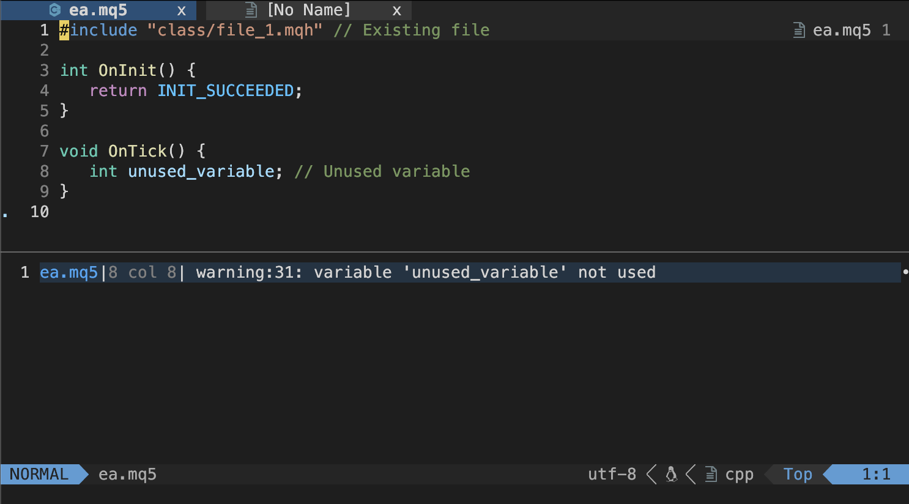
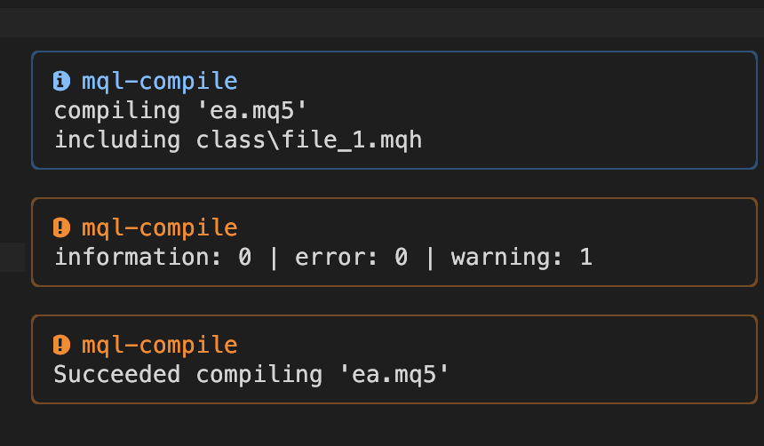
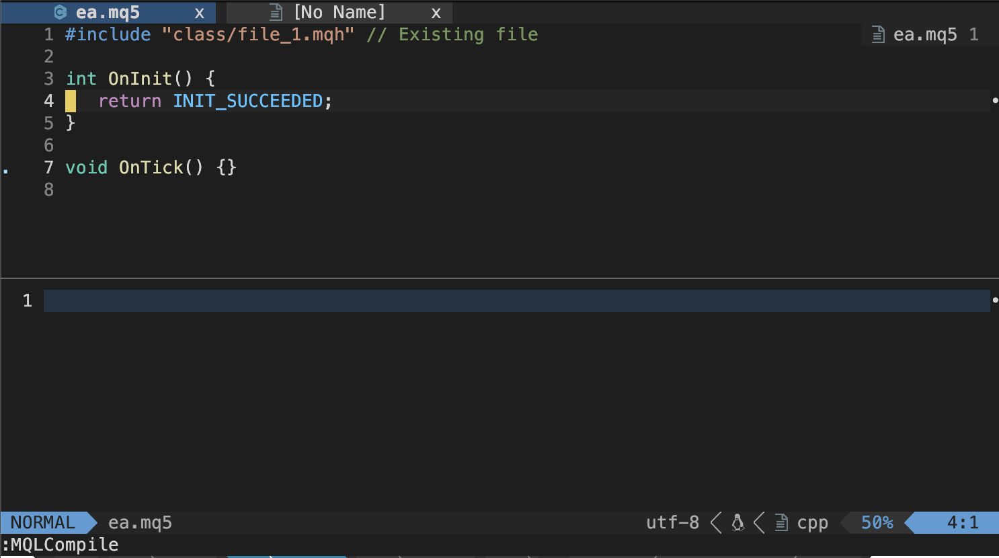

# mql-compile.nvim

## Concepts
A Neovim plugin for compiling MQL5 scripts.  
Without heavy MetaEditor GUI (Compiles on command-line).

> [!Caution]
> Still testing. Be careful to use, not to lose your files.

> [!Caution]
> Currently works only in 'macOS + wine(wineskin) + MT5' environment.


## Screen shots
With [nvim-notify](https://github.com/rcarriga/nvim-notify)

### On error


### On warning





### On success




## Features

**Main features**
- Compile MQL5
- Show errors in quickfix (& jump to the position)
- Auto detect mql5/mql4 by given source path
- Works on `MacOS + wine(wineskin)`

**Not implemented**
- Compile MQL4 (in future)
- Async compiling (in future)
- Works on Windows (in future)
- Works on Linux (just not tested)


## Requirement

**Mandatory**
- nvim v0.10.2 (My environment. It seems to work in a little older versions.)
- MT5
- wine (for now)

**Required**
- [plenary.nvim](https://github.com/nvim-lua/plenary.nvim) for async

**Optional**
- [nvim-bqf](https://github.com/kevinhwang91/nvim-bqf) Super easy to use quickfix
- [nvim-notify](https://github.com/rcarriga/nvim-notify) Nice style notify messages

> [!Caution]
> nvim-notify: Only v3.14.0 or earlier versions work for now as its error.


## Installation

Using [Lazy.nvim](https://github.com/folke/lazy.nvim):

```lua
-- Minimum config:
return {
   'riodelphino/mql-compile.nvim',
   requires = { 'nvim-lua/plenary.nvim' },
   lazy = true,
   ft = { 'cpp', 'c' }, -- If your filetype settings read mql5 as cpp / mql4 as c.
   opts = {
      ft = {
         mql5 = {
            metaeditor_path = '~/Applications/Wineskin/MT5.app/drive_c/Program Files/MetaTrader 5/MetaEditor64.exe', -- your MT5 exe's path
            wine_drive_letter = 'Z:',
         },
         mql4 = {
            metaeditor_path = '~/Applications/Wineskin/MT4.app/drive_c/Program Files (x86)/XMTrading MT4/metaeditor.exe', -- your MT4 exe's path
            wine_drive_letter = 'Z:',
         },
      },
   },
   keys = {},
   cmds = {
      { 'MQLCompile', 'MQLCompileSetSource', 'MQLCompileShowOptions' },
   },
}
```

## Default options

```lua
   opts = {
      priority = { 'mql5', 'mql4' }, -- priority for auto file detection
      log = {
         extension = 'log',
         delete_after_load = true,
         parse = nil,
      },
      quickfix = {
         extension = 'qf',
         keywords = { 'error', 'warning', }, -- Shows in quickfix. 'error' | 'warning' | 'information'
         auto_open = {
            enabled = true, -- Open quickfix after compile
            open_with = { 'error', 'warning', },
         },
         delete_after_load = true,
         format = nil,
      },
      information = {
         show_notify = true, -- 'information' can be shown in notify too. (Reommend)
         extension = 'info',
         actions = { 'including' }, -- Actions to show. 'compiling' | 'including'
         parse = nil,
         format = nil,
      },
      wine = {
         enabled = true,
         command = 'wine', -- Wine command path, if you installed MT4/5 with wine.
      },
      ft = {
         mql5 = {
            metaeditor_path = '~/Applications/Wineskin/MT5.app/drive_c/Program Files/MetaTrader 5/MetaEditor64.exe', -- your MT5 exe's path
            include_path = '',
            pattern = '*.mq5',
            wine_drive_letter = 'Z:',
         },
         mql4 = {
            metaeditor_path = '~/Applications/Wineskin/MT4.app/drive_c/Program Files (x86)/XMTrading MT4/metaeditor.exe', -- your MT4 exe's path
            include_path = '',
            pattern = '*.mq4',
            wine_drive_letter = 'Z:',
         },
      },
      notify = { -- Timings to notify to user
         compile = {
            on_start = false,
            on_failed = true,
            on_succeeded = true,
         },
         information = {
            on_saved = false,
            on_deleted = false,
            -- on_load = false,
            counts = false,
            actions = { 'including', }, -- 'compiling' | 'including'
         },
         quickfix = {
            on_saved = false,
            on_deleted = false,
         },
         log = {
            on_saved = false,
            on_deleted = false,
            counts = true,
         },
      },
   },
```


## Default 'metaeditor_path'

Below are the default path for MetaEditor exe in `opts.ft.[mql5|mql4]`.  
(It depends on your settings on installing.)
### MT5
```lua
 -- MacOS (via wine)
 -- 'MT5.app' is the name of app you set on wineskin.
 metaeditor_path = '~/Applications/Wineskin/MT5.app/drive_c/Program Files/MetaTrader 5/MetaEditor64.exe'
 -- Windows (NOT TESTED. just a note)
 metaeditor_path = 'C:\\Program Files\\MetaTrader 5\\MetaEditor64.exe'
 ```

### MT4

 ```lua
 -- MacOS (via wine)
 -- 'MT4.app' is the name of app you set on wineskin.
 metaeditor_path = '~/Applications/Wineskin/MT5.app/drive_c/Program Files (x86)/MetaTrader 4/metaeditor.exe'
 -- Windows (NOT TESTED. just a note)
 metaeditor_path = 'C:\\Program Files (x86)\\MetaTrader 4\\metaeditor.exe'
```

## Parsing and formatting

You can modify parsing & formatting functions, if you need.  
Leave 'parse' or 'format' as nil to use these default functions. 


### Parsing function to read log

Default:
```lua
opts = {
   log = {
      parse = function(line, e)
         if e.type == 'error' or e.type == 'warning' then
            e.file, e.line, e.col, e.code, e.msg = line:match('^(.*)%((%d+),(%d+)%) : ' .. e.type .. ' (%d+): (.*)$')
         elseif e.type == 'information' then
            e.file, e.msg = line:match('^(.*) : ' .. e.type .. ': (.*)$')
         end
         return e
      end,
   },
},
```

### Formatting function to generate quickfix

Default:
```lua
opts = {
   quickfix = {
      format = function(e)
         if e.type == 'error' or e.type == 'warning' then
            return string.format('%s:%d:%d: %s:%s: %s', e.file, e.line, e.col, e.type, e.code, e.msg)
         elseif e.type == 'information' then
            return string.format('%s:1:1: %s: %s', e.file, e.type, e.msg)
         end
      end,
   },
},

```

### Parsing and formatting function of information

Default:
```lua
opts = {
   information = {
      parse = function(line, i)
         i.file, i.type, i.action, i.details = line:match('^(.-) : (%w+): (%w+) (.+)')
         return i
      end,
      format = function(i)
         return string.format('%s %s', i.action, i.details)
      end,
   },
},

```
## Commands

### Compiling
```vim
" Set mql5 path
:MQLCompileSetSource my_ea.mq5
" Compile it
:MQLCompile
```
or
```vim
" Set current file path
:MQLCompileSetSource
" Compile it
:MQLCompile
```
or
```vim
" Compile with path
:MQLCompile my_ea.mq5
" Compile with file name modifier
:MQLCompile %
```

This plugin auto-detects mql5/mql4 by patterns given in `opts.ft.[mql5|mql4].pattern`.
See [Auto detection rules](#auto-detection-rules).

```vim
" Set source in NO mql5/4 buffers (like *.md)
:MQLCompileSetSource
" Automatically detect file, and set it as source

" Compiling also works same way.
:MQLCompile
" Automatically detect file, and compile it
```

So, `:MQLCompileSetSource` & Auto-detection allow you to compile the file anywhere in the project.


### Show options
Show all current options as table. Just for checking.
```vim
:MQLCompileShowOptions
```

## Lua functions

Below lua functions are also available. (with auto-detection by the extension)
```lua
-- Set mql5 path
require('mql_compile').set_source('my_ea.mq5')
-- Compile it
require('mql_compile').compile()
```
or
```lua
-- Set current file path
require('mql_compile').set_source()
-- Compile it
require('mql_compile').compile()
```
or
```lua
-- Compile with path
require('mql_compile').compile('my_ea.mq5')
-- Compile with file name modifier
require('mql_compile').compile('%')
```

## Keymaps

Sample:
```lua
keys = {
    { '<F4>', '<cmd>MQLCompileSetSource<cr>' },
    { '<F7>', '<cmd>MQLCompile<cr>' },
},
```
or
```lua
keys = {
    { '<F4>', function() require('mql_compile').set_source() end },
    { '<F7>', function() require('mql_compile').compile() end },
},
```

## Auto detection rules


### :MQLCompileSetSource

If the arg is set like `:MQLCompileSetSource %` or `:MQLCompileSetSource my_ea.mq5`, the command set it as source path preferentially.

But if no args are set, like `:MQLCompileSetSource`, the commannd detect the files automatically.  
The detection order is below.

1. Current buffer (if mql5/4)
2. First detected mql5/4 file in git root dir (recursively)
3. First detected mql5/4 file in cwd dir (recursively)

If no files are detected, the command returns `error`.

### :MQLCompile

The compiling command without arg, like `:MQLCompile`, also detects the files in almost same way.

1. The path set by `:MQLCompileSetSource` command previousely
2. Current buffer (if mql5/4)
3. First detected mql5/4 file in git root dir (recursively)
4. First detected mql5/4 file in cwd dir (recursively)

### Lua functions

And [these lua functions](#lua-functions) follow same rules.


## notify

This plugin uses `vim.notify()` to show messages to users.  
For those who want to have nicer messages, follow this.

1. Install [nvim-notify](https://github.com/rcarriga/nvim-notify)
2. Put code `vim.notify = require('notify')` in notify's lazy.nvim config, to replace default notify.

Then `mql-compile` shows you messages through it.


## TO-DO

> [!Important]
> Urgent!!!

- [ ] Adoopt to Windows
   - [ ] lfs library ?
   - [ ] Standard library ?
      - [ ] separator : package.config:sub(1, 1) -- "/" or "\\"
      - [ ] homedir: vim.fn.expand("~")
      - [ ] tmpdir : vim.fn.tempname() or vim.loop.os_tmpdir()
      - [ ] join   : vim.fs.joinpath("folder", "subfolder", "file.txt") (nvim v0.9 or later)
- [ ] ❗️Async compile
- [ ] Fit for `https://github.com/kevinhwang91/nvim-bqf` ?
- [ ] git
   - [x] Detect git root
   - [ ] List up & select from git root's mql5 files 
   - [ ] If only one mql5 on git root, compile without prompt
- [ ] Show fugitive message on progress & success or error
- [ ] include path NOT WORKS for the space char in `Program Files`

> [!Note]
> Hope to add in future

- [ ] MQL4 compiling (has problem with log file's encoding)

